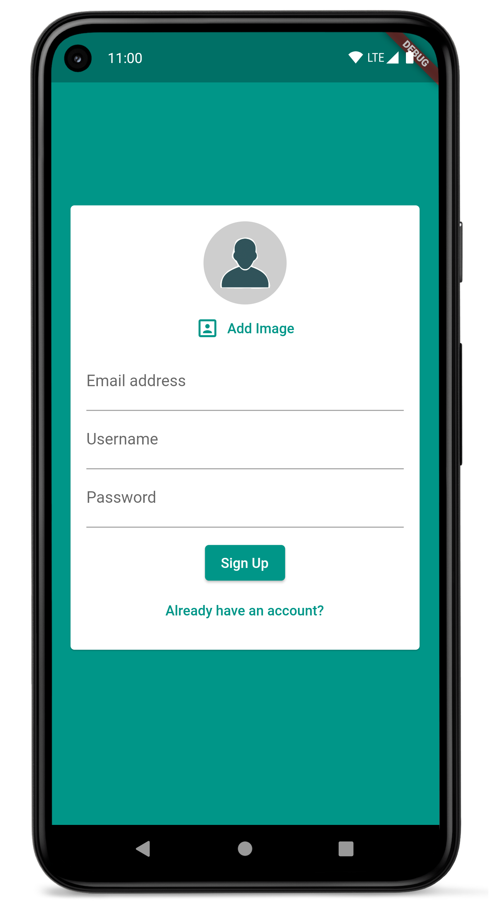
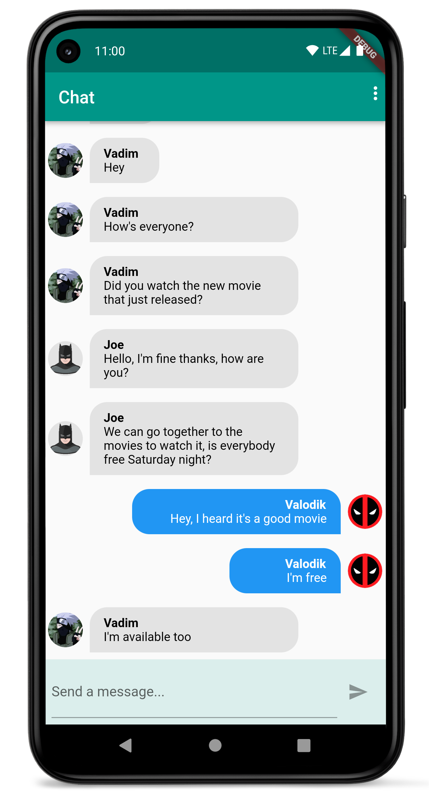

# chat_app

A chat app, with signup, login and notifications. currently it has one public chatroom where all
users chat.

The [Provider package](https://pub.dev/packages/provider) is used for state management, which is
enough for this kind and size of app. [Firebase](https://firebase.google.com/) is used as the
backend with the following packages:

- [firebase_core](https://pub.dev/packages/firebase_core)
- [firebase_auth](https://pub.dev/packages/firebase_auth)
- [cloud_firestore](https://pub.dev/packages/cloud_firestore)
- [firebase_storage](https://pub.dev/packages/firebase_storage)
- [firebase_messaging](https://pub.dev/packages/firebase_messaging)
- [firebase_analytics](https://pub.dev/packages/firebase_analytics)
- [firebase_crashlytics](https://pub.dev/packages/firebase_crashlytics)

and [image_picker](https://pub.dev/packages/image_picker) is used to choose profile the picture from
device storage

